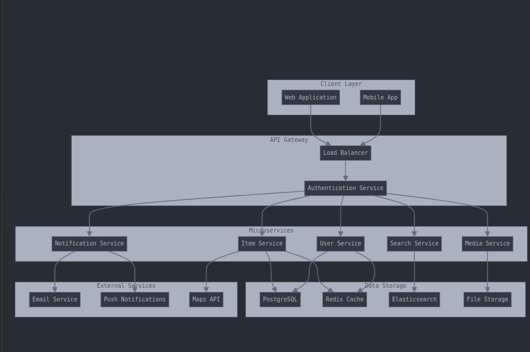
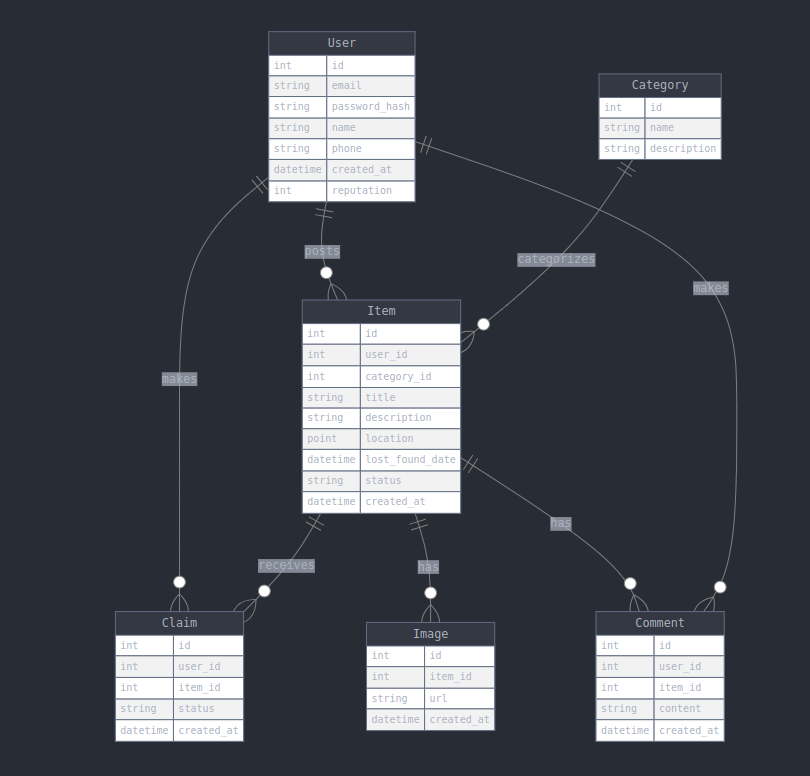

Here's an enhanced version of your README with more detailed information:

----------

# Lost and Found System

The **Lost and Found System** is a web application designed to help users easily submit, search, and claim lost items. Whether you’ve misplaced an item or found something, this platform allows seamless interaction for submitting and managing lost and found items.

This repository contains the **backend API** of the application, which is built using Django and structured for scalability, security, and ease of use.


----------

## Features

-   **Submit Lost Items:** Users can register items they’ve lost, providing a detailed description and relevant details.
-   **Search for Lost Items:** Users can search for lost items based on various filters such as type, location, and date.
-   **Claim Found Items:** Users who have found an item can claim ownership or report it through the system.
-   **Item Tracking:** Items can be tracked through their status and location history.
-   **User Authentication:** Secure login and registration features for both claimants and owners.

----------

## Project Structure

The project follows the standard Django structure with clear separation of concerns into different apps for modularity:

```
lost_and_found/
├── manage.py            # Django command-line utility for administrative tasks
├── requirements.txt      # Python dependencies
├── .env.example          # Sample environment variables
├── lost_and_found/
│   ├── __init__.py       # Django app initialization
│   ├── settings.py       # Project settings
│   ├── urls.py           # URL routing configuration
│   └── wsgi.py           # WSGI entry-point for deployment
└── apps/                  # Core application modules
    ├── users/             # User management (authentication)
    │   ├── __init__.py    # App initialization
    │   ├── models.py      # User models
    │   ├── serializers.py # Serialization for user data
    │   ├── views.py       # User-related views
    │   └── urls.py        # User URL routing
    ├── items/             # Lost and found items management
    │   ├── __init__.py    # App initialization
    │   ├── models.py      # Item models
    │   ├── serializers.py # Serialization for item data
    │   ├── views.py       # Item-related views
    │   └── urls.py        # Item URL routing
    └── claims/            # Claims related to found items
        ├── __init__.py    # App initialization
        ├── models.py      # Claim models
        ├── serializers.py # Serialization for claim data
        ├── views.py       # Claim-related views
        └── urls.py        # Claim URL routing

```

----------

## System Architecture

The system is designed with modularity in mind, with a clear separation between the user management, items, and claims functionality. Each component interacts with the others to ensure smooth data flow and interactions.



----------

## Data Models

The core data models for the system include Users, Items, and Claims. These models ensure that the platform is capable of storing and retrieving the necessary information for lost and found processes.

-   **User Model:** Handles user registration, authentication, and roles.
-   **Item Model:** Stores details of lost and found items.
-   **Claim Model:** Manages the process of users claiming found items.



----------

## Requirements

-   Python 3.8+
-   Django 4.x
-   PostgreSQL (recommended for production)
-   Other dependencies listed in `requirements.txt`

----------

## Setup Instructions

1.  **Clone the repository:**
    
    ```bash
    git clone https://github.com/Rugwiroparfait/lost-and-found-system.git
    cd lost-and-found-system
    
    ```
    
2.  **Set up virtual environment (optional but recommended):**
    
    ```bash
    python3 -m venv venv
    source venv/bin/activate  # On Windows: venv\Scripts\activate
    
    ```
    
3.  **Install dependencies:**
    
    ```bash
    pip install -r requirements.txt
    
    ```
    
4.  **Configure environment variables:**
    
    Copy `.env.example` to `.env` and adjust settings like the database URL and secret keys.
    
5.  **Run migrations:**
    
    ```bash
    python manage.py migrate
    
    ```
    
6.  **Run the development server:**
    
    ```bash
    python manage.py runserver
    
    ```
    
    Your application should now be running on `http://127.0.0.1:8000/`.
    

----------

## Contributing

Feel free to fork the repository and submit pull requests. Contributions, whether for bug fixes, features, or improvements, are always welcome.

----------

## License

This project is licensed under the MIT License - see the LICENSE file for details.

